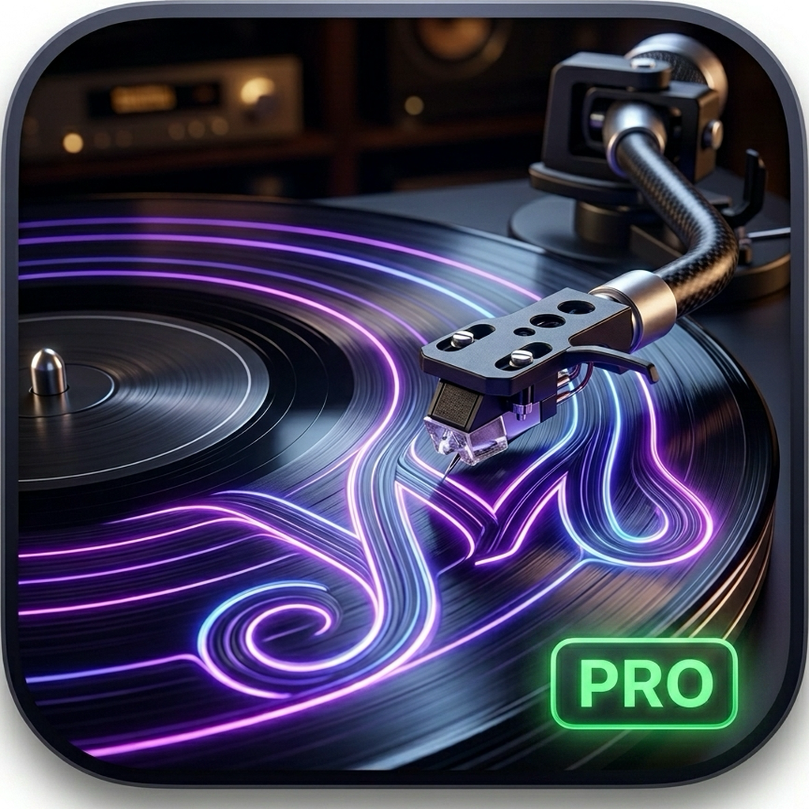

<p align="center">
  
</p>

<h1 align="center">YM Pro</h1>

<p align="center">
  <strong>Bit-Perfect Audiophile Music Player for macOS</strong>
</p>

<p align="center">
  <a href="#"></a>
  <a href="#"></a>
  <a href="#"></a>
  <a href="#"></a>
</p>

<p align="center">
  <!-- TODO: Replace with actual App Store link once published -->
  <a href="https://apps.apple.com/app/ym-pro/id__YOUR_APP_ID__">
    
  </a>
</p>

---

YM Pro is a native macOS music player meticulously engineered for audiophiles. It bypasses the macOS system mixer entirely, taking exclusive hardware-level control of your DAC to deliver **true bit-perfect playback** — pure, untouched, exactly as the artist intended.

If you own high-resolution FLAC files and a premium external DAC, standard players silently resample your audio in the background. **YM Pro doesn't.**

---

## ✨ Features

| Feature | Description |
|---|---|
| 🎛️ **Bit-Perfect CoreAudio HAL** | Custom C++ engine talks directly to your audio hardware, completely bypassing the macOS system mixer. |
| 🔒 **Exclusive Hog Mode** | Locks your DAC so no system alerts or other apps can interfere with your listening session. |
| 🔄 **Dynamic Sample Rate Switching** | Automatically changes your hardware's sample rate on-the-fly to match each track (44.1kHz → 96kHz → 192kHz). |
| 🎵 **Native FLAC Decoding** | High-performance C++ decoder with gapless, zero-latency playback on a dedicated background thread. |
| 📊 **Hi-Res Badges** | Automatically detects and displays bit-depth/sample-rate info with dynamic Hi-Res Audio badges. |
| 🎨 **Glassmorphism UI** | Stunning dark interface built 100% in SwiftUI with ambient gradients, blur effects, and smooth animations. |
| 📁 **Folder Hierarchy Browser** | Navigate your music library exactly as it's organized on disk — no forced "Album/Artist" view. |
| 📋 **Playlists** | Create, manage, and drag-and-drop tracks into custom playlists. |
| 🔍 **Instant Search** | Full-text search powered by SQLite FTS5 across titles, artists, albums, and file paths. |
| ⌨️ **Touch Bar & Media Keys** | Full playback control from your keyboard and MacBook Touch Bar with live track info. |
| 🧩 **macOS Widget** | Now Playing widget for your desktop via WidgetKit. |
| 🎬 **Intro Splash** | Premium animated logo intro on app launch. |

---

## 🏗️ Architecture

```
┌─────────────────────────────────────────────────────────┐
│                     SwiftUI (macOS 13+)                  │
│  ContentView · NowPlayingBar · FullScreenPlayer · ...    │
├─────────────────────────────────────────────────────────┤
│                   PlaybackViewModel                      │
│          Queue · Shuffle · Repeat · Gapless              │
├──────────────────┬──────────────────────────────────────┤
│  CoreAudioHAL    │         LibraryViewModel              │
│  Engine (Swift)  │     GRDB (SQLite + FTS5)              │
│  ┌────────────┐  │  ┌──────────────────────────────┐    │
│  │ Hog Mode   │  │  │  MetadataBridge (C++ TagLib) │    │
│  │ SampleRate  │  │  │  Artwork · Tags · Properties │    │
│  │ Exclusive   │  │  └──────────────────────────────┘    │
│  └─────┬──────┘  │                                      │
│        │         │                                      │
│  ┌─────▼──────┐  │                                      │
│  │ AVDecoder  │  │                                      │
│  │ Worker     │  │                                      │
│  │ (C++ FLAC) │  │                                      │
│  └────────────┘  │                                      │
├──────────────────┴──────────────────────────────────────┤
│              macOS CoreAudio HAL (Hardware)               │
│                   Your DAC / Speakers                     │
└─────────────────────────────────────────────────────────┘
```

**Key layers:**
- **UI Layer** — SwiftUI with `NavigationSplitView`, custom glassmorphism, and `NSVisualEffectView` bridges.
- **Playback Engine** — A Swift `CoreAudioHALEngine` class that configures `AudioDeviceID`, sets the hardware sample rate, acquires Hog Mode, and feeds PCM buffers via an `IOProc` callback.
- **Decoder** — A C++ `AVDecoderWorker` using `libFLAC` to decode FLAC frames on a background thread, piping interleaved PCM into a lock-free ring buffer.
- **Metadata** — A C++ `MetadataBridge` using `TagLib` to extract Vorbis Comments, ID3v2 tags, embedded artwork (FLAC Picture blocks, APIC frames, MP4 cover art).
- **Database** — GRDB (SQLite) with FTS5 full-text search, batch upserts, and play count tracking.

---

## 🖥️ Screenshots

<!-- TODO: Add screenshots of the app here -->
<!--  -->
<!--  -->

*Screenshots coming soon.*

---

## 📦 Prerequisites

| Requirement | Version |
|---|---|
| macOS | 13.0 (Ventura) or later |
| Xcode | 16.0 or later |
| Homebrew | Latest |
| Apple Silicon | Required (arm64) |

---

## 🚀 Build from Source

```bash
# 1. Install dependencies
brew install xcodegen flac taglib

# 2. Clone the repository
git clone https://github.com/yoneshmurugan/Player.git
cd Player

# 3. Generate the Xcode project
xcodegen generate

# 4. Open in Xcode
open "YM Pro.xcodeproj"
```

Select **My Mac** as the destination and hit **⌘R** to build and run.

> **Note:** The FLAC and TagLib libraries are linked from `/opt/homebrew/lib`. If you installed Homebrew to a non-default location, update the `HEADER_SEARCH_PATHS` and `LIBRARY_SEARCH_PATHS` in `project.yml`.

---

## 🎧 Usage

1. Launch YM Pro.
2. Open **Settings** (gear icon in the sidebar).
3. Click the folder icon and select the directory containing your audio files (`.flac`, `.mp3`, `.m4a`, `.wav`, `.aiff`).
4. Your library is instantly scanned — browse by **Albums**, **Artists**, **Tracks**, or **Folder Hierarchy**.
5. Toggle **Bit-Perfect Mode** in Settings to enable exclusive DAC access and hardware sample rate switching.

---

## 🗂️ Project Structure

```
Player/
├── project.yml                 # XcodeGen project definition
├── ytsplayer/
│   ├── App/                    # App entry point, bridging header, Info.plist
│   ├── Assets/                 # Intro video, Hi-Res badge
│   ├── Assets.xcassets/        # App icon, logo
│   ├── Engine/                 # CoreAudioHALEngine, AVDecoderWorker (C++), MetadataBridge (C++)
│   ├── Model/                  # Track, Album data models
│   ├── Utilities/              # ImageLoader, helpers
│   ├── ViewModel/              # PlaybackViewModel, LibraryViewModel, SearchViewModel
│   └── Views/                  # All SwiftUI views
├── ytsplayerWidget/            # macOS WidgetKit extension
├── ytsplayerTests/             # Unit tests
└── GRDB/                       # Local GRDB SQLite package
```

---

## 🤝 Contributing

Pull requests are welcome. For major changes, please open an issue first to discuss what you would like to change.

---

## 📄 License

This project is licensed under the [MIT License](LICENSE).

---

<p align="center">
  <sub>Built with ❤️ by <a href="https://github.com/yoneshmurugan">Yonesh</a></sub>
</p>
